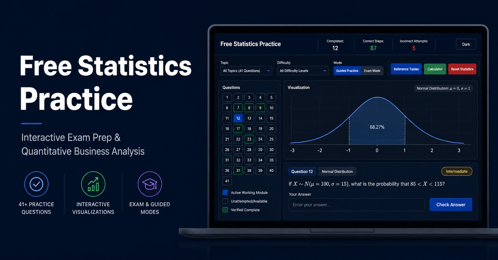

# 📊 Free Statistics Practice

An interactive web application designed to help students prepare for **Quantitative Business Analysis** and other core statistical courses.

🔗 **[Launch the App Live](https://www.freestatspractice.com/)**

---

## 💡 About the Project

After taking a qualification exam for my Quantitative Business Analysis course, I realized how guided practice could help ease the learning curve. I built this interactive tool to walk students through challenging problems step by step, thereby making the learning process more intuitive.

---

## 🚀 Key Features

### 🛠️ Dual Learning Modes

- **Guided Tutor Mode:** Breaks down each problem step-by-step, guiding you through the logical path to the solution.
- **Exam Mode:** Simulates real test conditions by only prompting for the final answer.

### 📐 Integrated Reference Tables & Dynamic Math Symbols

- **Built-in Tables:** Quick access to essential statistical reference tables: **Cumulative Z**, **Mean-to-Z**, **Student's T**, and **Chi-Square**.
- **Insert Symbols Palette:** Easily insert standard symbols like mu (mean) and sigma (standard deviation) directly into your workspace using the built-in palette above the question.
- **Calculator:** A floating scientific calculator is included to aid computations.

### 📈 Interactive Data Visualizations

Once a problem is successfully solved, the application dynamically plots relevant charts—such as **Normal Distributions** and **Bar Charts**—to provide visual intuition for the answer. _(Note: This feature is a work in progress but is accurate for the majority of questions)._

### 🎯 Workspace & Customization

- **Custom Quizzing:** Filter the current test bank of **41 questions** by specific topics and difficulty levels.
- **Question Map Navigation:** A dedicated sidebar map on the left lets you jump smoothly between specific questions instantly.
- **Light/Dark Mode Toggle:** Seamless UI shift in the top right to protect your eyes during late-night study sessions.

---

## 🤝 Contributing & Test Bank

The test bank currently holds **41 questions**, and I am actively working to expand it. If you have a question or problem set from your coursework you would like to see added, please feel free to submit questions of your own!

---

## 📄 License

This repository is licensed under the permissive MIT License. Please feel free to adapt, build upon, redistribute, or share the material any way you would like.
Alternatively, if you would like to contribute improvements or features directly to the platform, feel free to submit a pull request and I will do my best to review and merge it into the codebase.
